# Applied Computer Vision — Showcase

Welcome to my portfolio of end results from the **Computer Vision for Engineers** course. This repository highlights key image processing tasks with brief descriptions.

---

## 🧠 Overview

Each task demonstrates a specific computer vision technique. Click on a task to view its details:

| Task | Description |
|------|-------------|
| [Object Identification](#-object-identification) | Recognising different types of spare parts and colour coding them |
| [Fault Detection](#fault-detection) | Detect and highlight faulty objects on production line |
| [PCB Trace Detection](#trace-detection) | Detect and highlight faulty objects on production line |
| [Gamma Correction](#gamma-correction) | Improve image visibility |
| [Crack Detection](#crack-detection) | Detect cracks generated in structural elements |
| [Image Stitching](#image-stitching) | Generating maps from aerial images |
| [Edge Detection](#edge-detection) | Extracting edges using Canny and Sobel operators |

---

## 🧹 Object Identification

| Before | After |
|--------|-------|
|  |  |

**Blue**: Ring Terminal

**Red**: Spade Terminal

**Violet**: Washer

**Green**: Internal Lock Washer

**Yellow**: External Lock Washer

---

## 🎯 Fault Detection

| Input | Fault Detection |
|----------------|------------------|
| 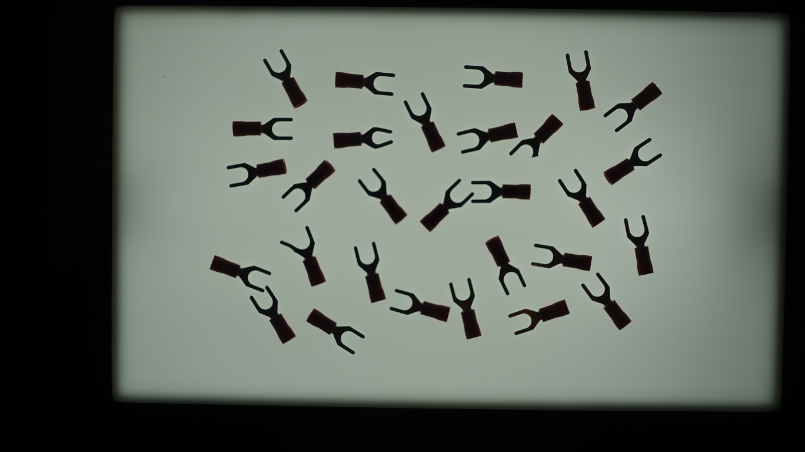 | 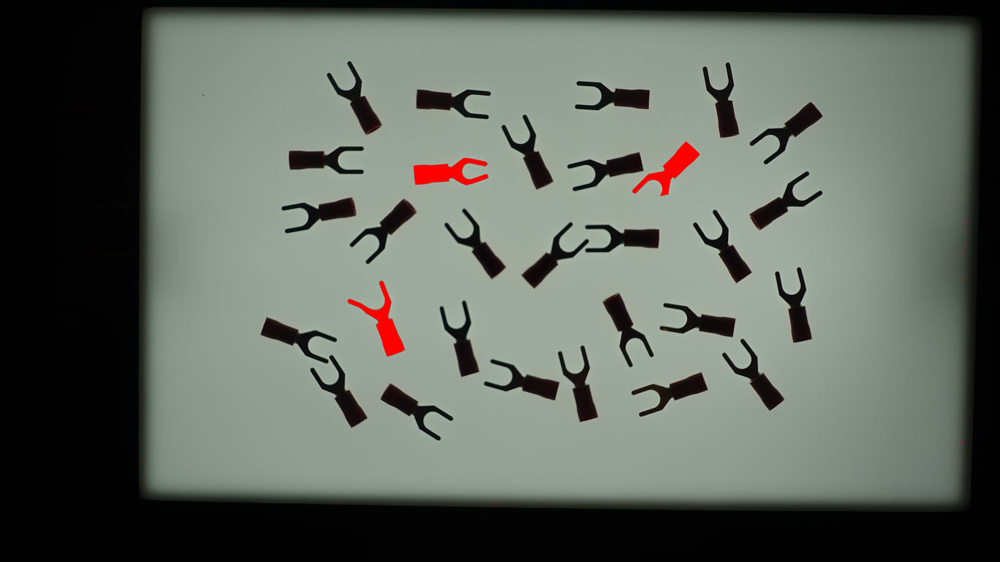 |

**Black**: Accepted

**Red**: Rejected

---

## 🎯 PCB Trace Detection

| Input | Trace Detection |
|----------------|------------------|
| 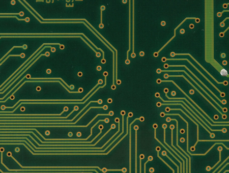 | 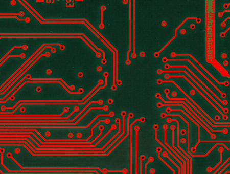 |

---

## 🧹 Gamma Correction

| Before | After |
|--------|-------|
| 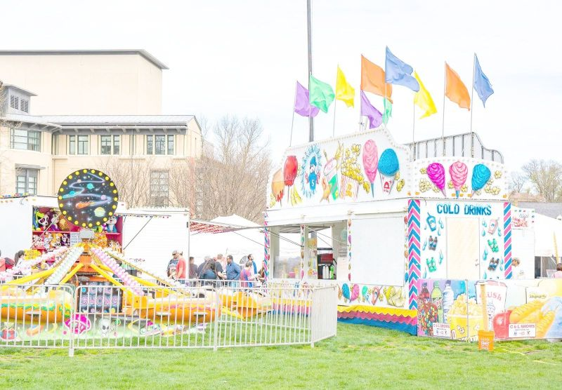 | 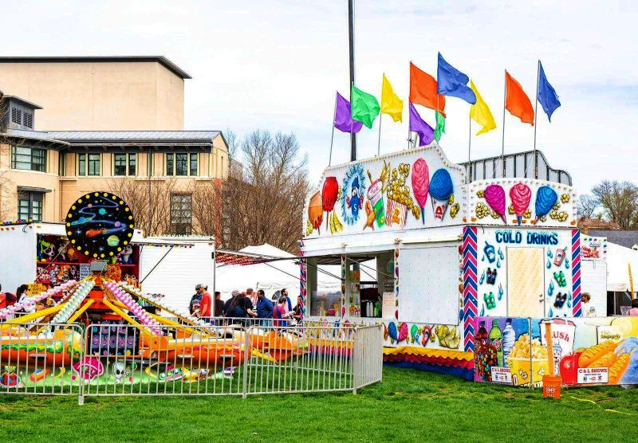 |

---

## 🎯 Crack Detection
| Input | Crack Detection |
|----------------|------------------|
| 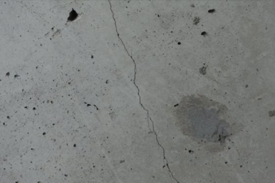 | 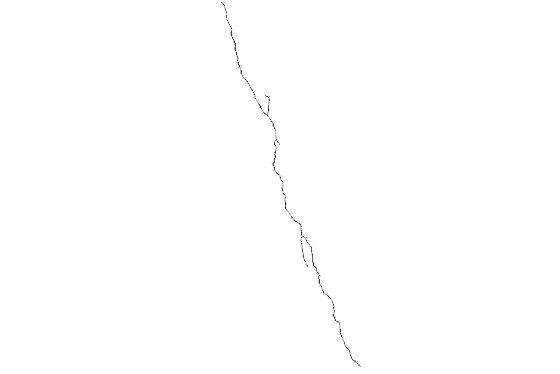 |

---

## 🎯 Locating Cancer

| Input | Cancer Detection |
|----------------|------------------|
|  | 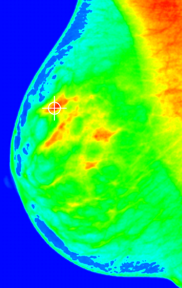 |

---

## 🧩 Image Stitching

| Output |
|------------------|
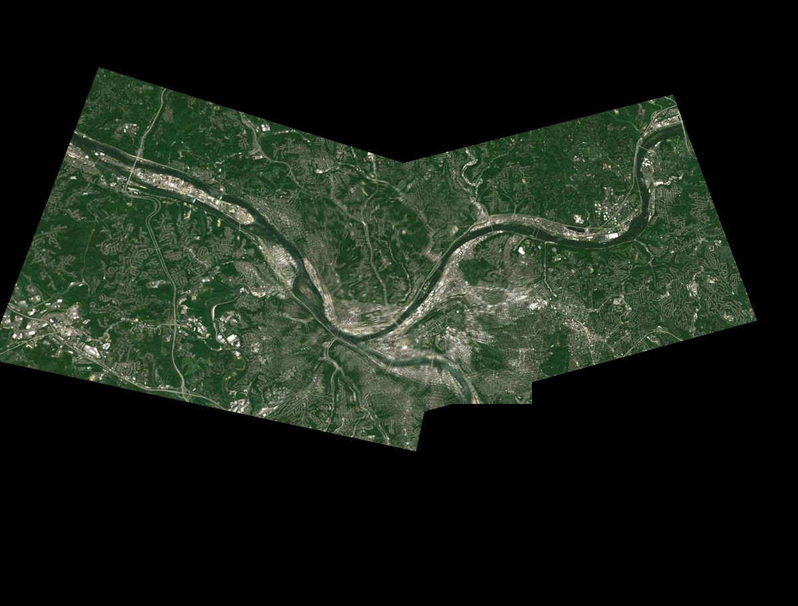 |

---

## ✂️ Edge Detection

| Original | Edges |
|----------|-------|
| 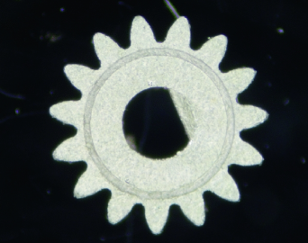 | 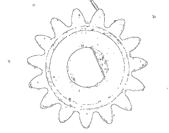 |

**Method**: Canny Edge Detector  
**Thresholds**: Low = 97, High = 78

---

## 📜 License

This work is licensed under the Creative Commons CC by 4.0 License.